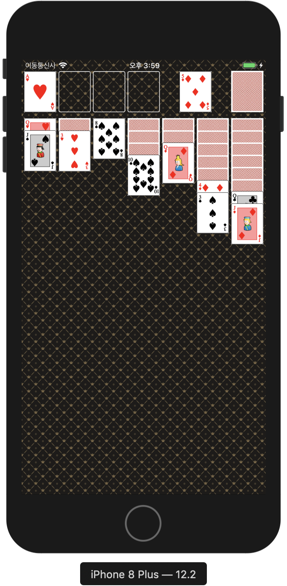
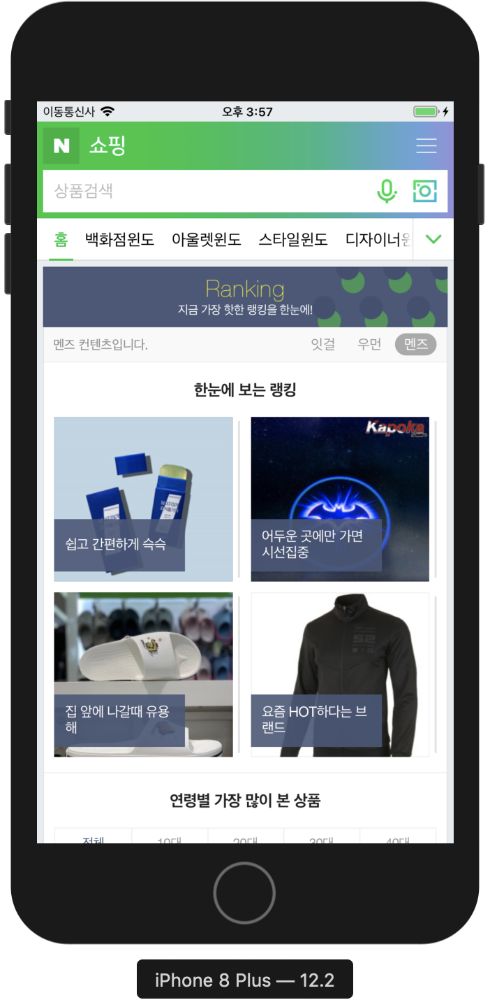
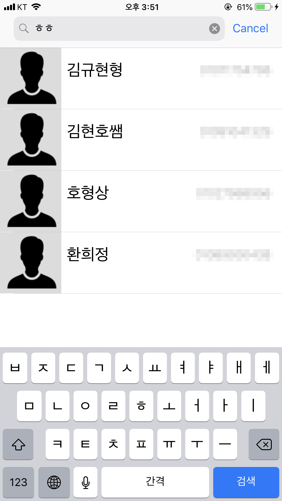
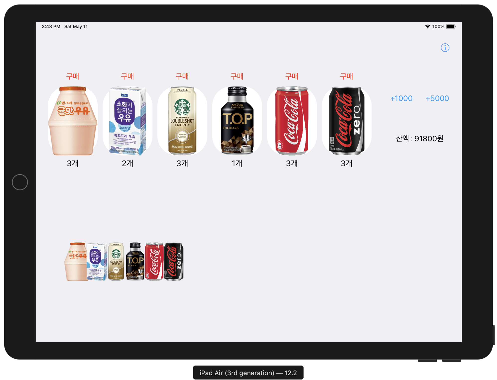
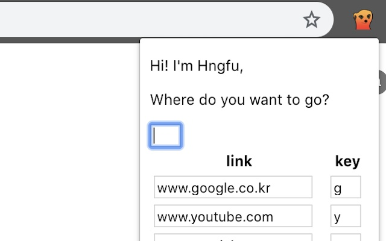

# 이력서

## 링크

Github: [https://github.com/hngfu](https://github.com/hngfu)

## 코드스쿼드

### Store App

링크: [https://github.com/hngfu/swift-storeapp](https://github.com/hngfu/swift-storeapp)

----

### CardGame App (Klondike Solitaire)

- 설명: 더블탭과 드래그를 이용한 카드게임 앱.

링크: [https://github.com/hngfu/swift-cardgameapp](https://github.com/hngfu/swift-cardgameapp)

----

### WebView App

- 설명: 메뉴 정보를 JSON형식으로 가져와서 콘솔창에 출력해주는 앱.

링크: [https://github.com/hngfu/swift-webviewapp](https://github.com/hngfu/swift-webviewapp)

----

### Address App

- 설명: 초성검색도 가능한 연락처 앱.

링크: [https://github.com/hngfu/swift-addressbookapp](https://github.com/hngfu/swift-addressbookapp)

----

### VendingMachine App

- 설명: 자판기에 물품, 돈을 추가하거나 물품을 구입할 수있는 앱.

링크: [https://github.com/hngfu/swift-vendingmachineapp](https://github.com/hngfu/swift-vendingmachineapp)

## 개인프로젝트

### HngfuIsSwift

- 설명: 단축키를 이용해 사이트를 새창으로 띄워주는 앱.
- 사용기술: chrome.storage API, html, javascript

Chrome Web Store: [https://chrome.google.com/webstore/detail/hngfuisswift/mkklklabflcildhpimhojcclkndjcpja?hl=ko](https://chrome.google.com/webstore/detail/hngfuisswift/mkklklabflcildhpimhojcclkndjcpja?hl=ko)

[Chrome Web Store](https://chrome.google.com/webstore/category/extensions?hl=ko)에서 `HngfuIsSwift`로 검색 가능
